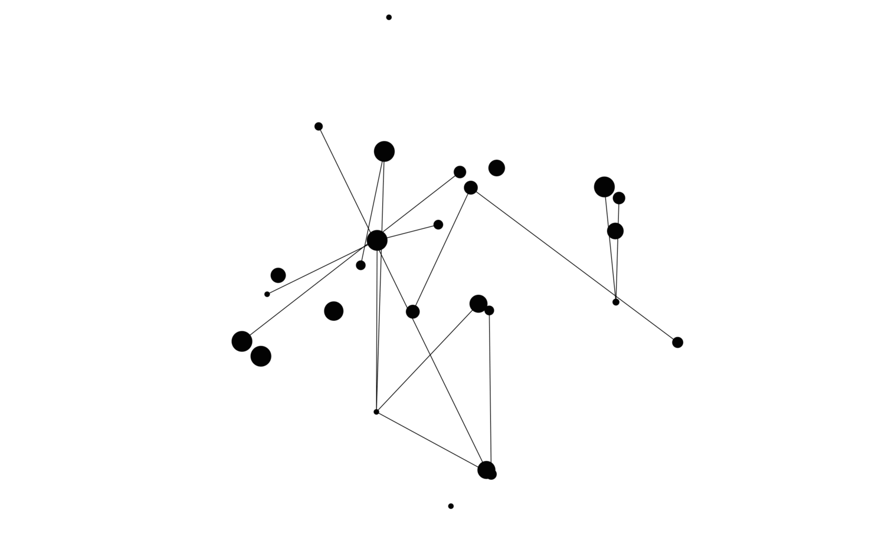

# The Random Graph Screensaver
**Author**: C. Howard

### So like, wtf, what is this?
Well.. this is a screensaver that generates a random graph and induces a simple harmonic motion upon the vertices of the graph to create a neat, dynamic affect!

### Cool, so where to find it?
Well, this project has the code in case you'd like to compile it yourself, but the screensaver file can be found in the `screensaver/` directory.

### How do I install the screensaver?
It is pretty straight forward, fortunately! After downloading the screensaver, right click and select **Open** and then select **Install** in the prompt that pops up. Should be all it takes!
